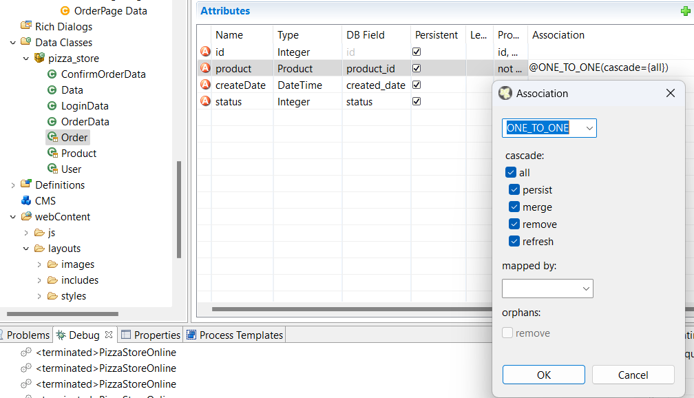
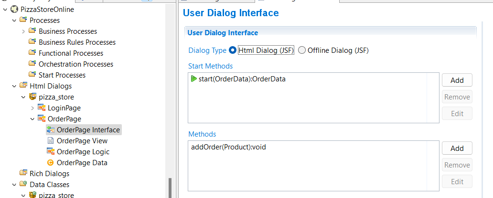
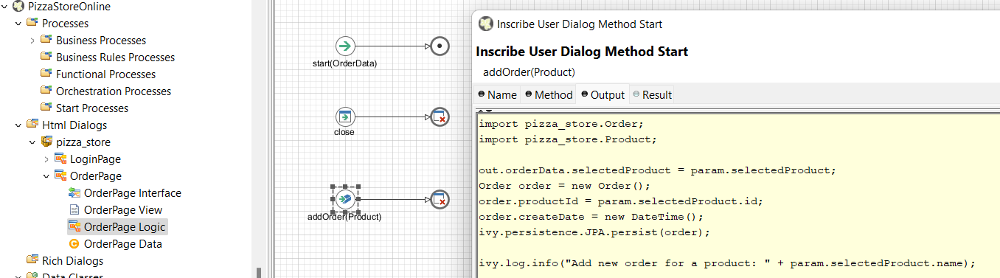
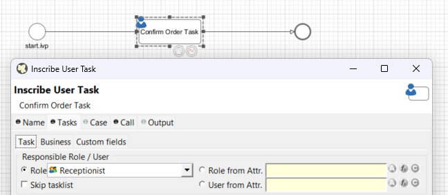
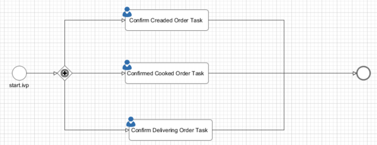

# Axon.Ivy Trainning Pizza Store Online
## Expected Goals
- Fundamental knowledge of Axon.ivy and its project.
- Build an Axon.ivy project name PizzaStore Online which supporting simple Use Case.
- Build an Axon.ivy project with more complicated business flows & integrating with external systems.
- Build & deploy Axon.ivy project using CI tools (Jenkins & SonarQube) (Optional).

## Overview
### Roles

1. Customer
2. Receptionsist
3. Chef
4. Delivery

### Usecases

TODO: Add later.

## Tasks

- [x] Setuy Ivy Environment.
- [x] Create a simple project with basic `Bussiness Process`. 
- [ ] Implement business usecases in backend. 
    - [ ] Customer order online. 
    - [ ] Login. 
    - [ ] Receptionist confirm orders. 
    - [ ] Chef confirm done. 
    - [ ] Deliver confirm the payment is done. 

- [ ] Implement GUI screens. 
- [ ] Deploy.
    - [ ] In-Memory Persistence.
    - [ ] JPA.


## Setup Environment

1. Setup `AxonIvyDesigner` environment following this [link](https://mesoneerag.atlassian.net/wiki/spaces/VZ/pages/3691282444/Setup+VZ+workspace). **Don't setup VZ projects.**

2. Go to folder `AxonIvyDesigner` and run file `Axon.ivy Designer.exe`. **Don't run `eclipsec.exe`**, it has error that don't show page view.

3. Create a new project and following the quick tutorial guide.

## How to run a simple Hello World

Add `Script` in `Activity` to process.

In `Code` tab add below code.
```java
ivy.log.info("Hello World");
```

## Adding bootstrap CSS framework
Import sample project `HtmlDialogDemos` the navigate to `Html Dialogs` -> `ch.ivyteam.htmldialog.demo.other` -> `Html5BootstrapDemo`.

Add bootstrap javascript lib.
```html
    <script src="#{resource['js/jquery-1.11.0.js']}"></script>
    <script src="#{resource['js/bootstrap-3.1.1.js']}"></script>
</h:body>
```

Add bootstrap css style to template file `webContent\layouts\HtmlDemo.xhtml`.
```html
<h:head>
  ....
	<!-- Bootstrap CSS -->
	<!-- You can also load bootstrap from an external CDN: //http://netdna.bootstrapcdn.com/bootstrap/3.2.0/css/bootstrap.min.css -->
	<h:outputStylesheet name="layouts/styles/bootstrap-modified-for-jsf.css" />
	<h:outputStylesheet name="layouts/styles/bootstrap-reset.css" />
	<h:outputStylesheet name="layouts/styles/ivy-common-6.css" />
	<h:outputStylesheet name="layouts/styles/style.css" />
</h:head>
```

Copy 2 folders `webContent\js` and `webContent\layout\styles` to new ivy project.


## Setup Database

I use postgres because it's better than mysql.

```shell
docker pull postgres:13.9
docker run 
  --name myPostgresDb 
  -p 5455:5432 
  -e POSTGRES_USER=postgresUser 
  -e POSTGRES_PASSWORD=postgresPW 
  -e POSTGRES_DB=postgresDB
  -d postgres:13.9
```

**When using postgres which has version above 13, I had below error**
```
Error: The authentication type 10 is not supported. Check that you have configured the pg_hba.conf file to include the client's IP address or subnet, and that it is using an authentication scheme supported by the driver.
```

Go to `Definitions` -> `Databases` to add new connection.

### Setup Persistence

Go to `Definitions` -> `Persistence` to add new persistence.

Go to `File` -> `Entity Class` to add new entity class. Define class fields equivalent to table fields.
To define reference to other entity use this way.


Go to `Persistence` to generate schema. I can only run `create` option. The `update` option has error.

### Access Data

Using `ivy.persistence.<persistence unit>` to access data.

#### Get Data
```java
import pizza_store.Product;

out.productList = ivy.persistence.<persistence unit>.findAll(Product.class);
```

Get with query
```java
int NEW_STATUS = 0;

List<Order> newCreatedOrders = ivy.persistence.JPA
	.createQuery("Select o FROM Order o WHERE o.status = :status")
	.setParameter("status", NEW_STATUS)
	.getResultList();
```

#### Save Data

```java
int CONFIRM_STATUS = 2;
param.order.status = CONFIRM_STATUS;
ivy.persistence.JPA.merge(param.order);
```

#### New Data

```java
// persist new created product
  Product product;
  product.name = "Product name";
  product.nr = 12;
  ivy.persistence.<persistence unit>.persist(product);

// get id of new created product
  Number newProductId = product.id;
```

When add an object has reference to other object, use `merge` instead of `persist`.

### View object property in jsf page

Using `data` object to access value.

```html
<ui:repeat value="#{data.orderData.productList}" var="product">
  <div>
    
    <h2>#{product.name}</h2>
  </div>
</ui:repeat>
```


### Add new order

1. Create a new method in `User Dialog Interface`


2. Add code for adding new order.
In `Logic` open the new adding method then navigate to `Output` tab. Add the following code.



3. Add handle event code in `View`.
Firstly add the `jsf` tag to `html` tag.

```html
<html xmlns="http://www.w3.org/1999/xhtml"
	xmlns:jsf="http://xmlns.jcp.org/jsf" # Add this line
```

Then add button to pass event to the defined method.

```html
<input
    type="submit" 
    id="Submit" 
    value="Add"
    class="btn btn-danger"
    jsf:actionListener="#{logic.addOrder(product)}" />
```

### Call async method.

Use tag `p:commandButton` to call ajax.

```html
<p:commandButton 
    value="Add" 
    actionListener="#{logic.addDrink(drink)}" 
    id="addDrink"/>	
```

### Update partial component in different form by ajax
```html
<p:commandButton
        styleClass="btn btn-primary"
        value="Add"
        update="j_id_h:customerInfoForm:ordersSummary"
        actionListener="#{logic.addDrink(orderItem.drink.id)}"
        id="addDrink" />
```

## Login and Role

### Create Role
In `Definitions` -> `Roles` create 3 new roles:
1. Receptionist
2. Chef
3. Delivery


### Login
Creat a simple Login page with username and password fields. Add a script element then add login code.
```java
boolean isValidLogin = ivy.session.loginSessionUser(in.Username, in.Password);
```

If you don't see the method `loginSessionUser` after typing `ivy.session.`, press combine keys `Control` + `Space` to show it.

### Create authorization task

In process view, replace `User Dialog` with `User Dialog` then assign correct role to it.


### Route page base on user's role
Use `Tasks` in `Event & Gateway` for routing tasks.


## How to build

1. Maven central repo has require https instead of http, so we muss add the following lines to `pom.xml`
```xml
<distributionManagement>
  <repository>
    <id>Central Maven repository</id>
    <name>Central Maven repository https</name>
    <url>https://repo.maven.apache.org/maven2</url>
  </repository>
</distributionManagement>
```

2. Likewise build step require download IvyEngine but maven couldn't do it so I downloaded manually in page `https://developer.axonivy.com/download/maven.html` then added its path to `pom.xml`.
```xml
<plugin>
  <groupId>com.axonivy.ivy.ci</groupId>
  <artifactId>project-build-plugin</artifactId>
  <version>6.3.0</version>
  <extensions>true</extensions>
  <configuration>
    <deployToEngineApplication>Portal</deployToEngineApplication>
    <engineDirectory>D:\AxonIvyEngine</engineDirectory> # Add this line
  </configuration>
</plugin>
```

3. Run `mvn clean install package`. The `.iar` output file is in the `target` directory.